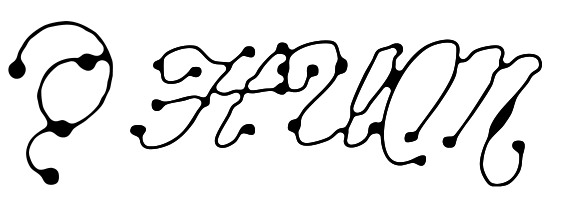
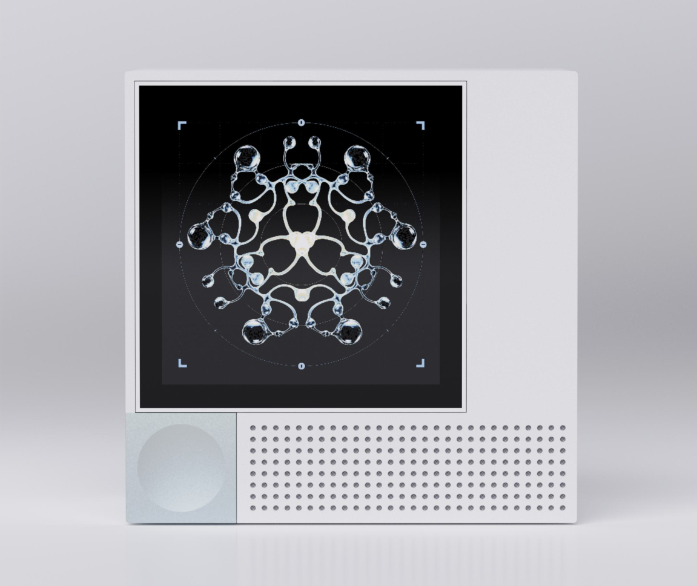
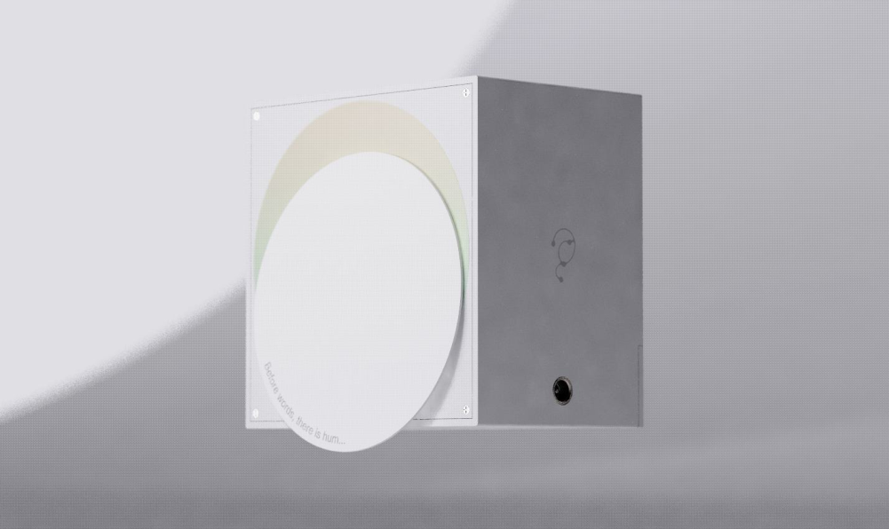
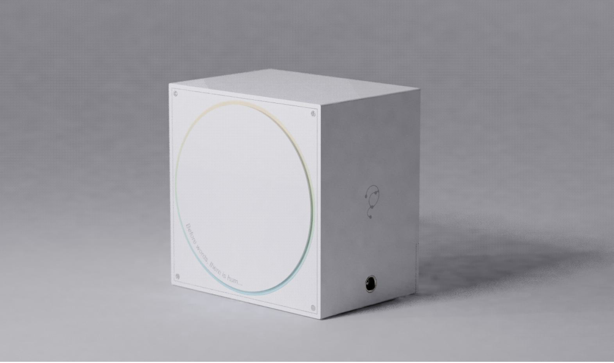
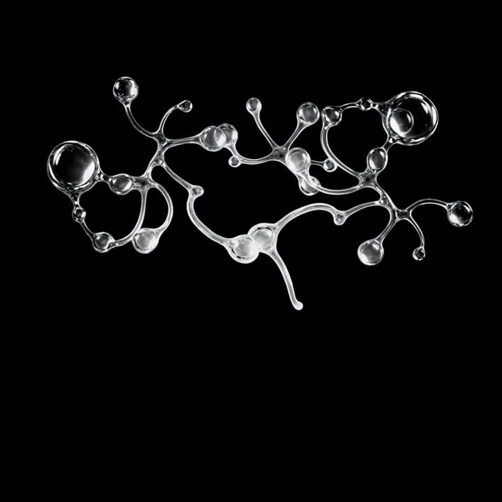
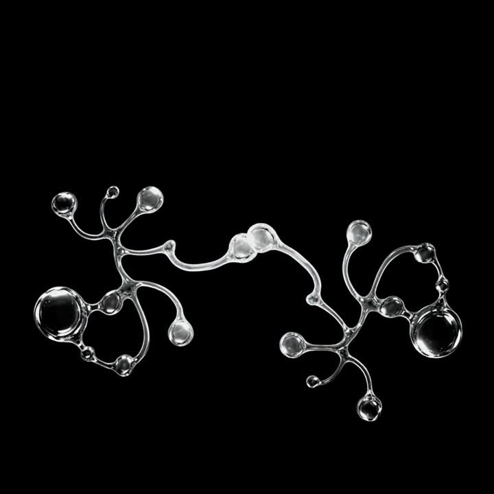
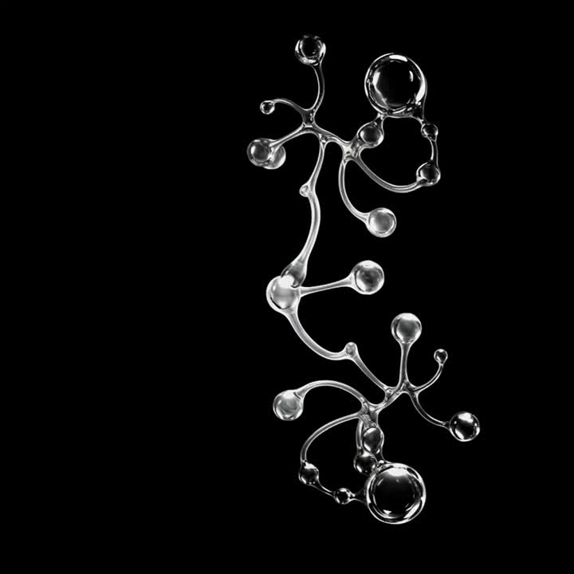
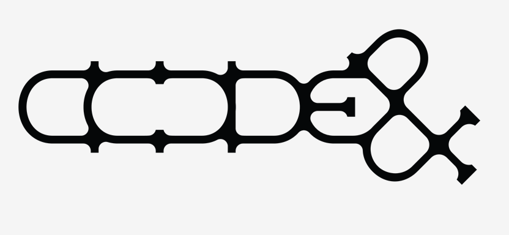

  

<strong>일상을 듣다. 감각을 남기다.</strong> Sound–Visual Archiving Device · A product by code&amp;

<a href="https://hum-archive.com/">브랜드 사이트</a> · <a href="https://hum-archive.com/#archive">그래픽 조합 체험</a>

# HUM by code&

**일상을 듣다. 감각을 남기다.**

HUM은 일상의 소리를 채집하고, 그 순간의 감각을 시각적 아트워크로 간직하는 **사운드–비주얼 아카이빙 디바이스**입니다. 화면을 바라보느라 지나쳤던 주변의 소리에 귀를 기울이고, 매일 하나의 순간을 나만의 기록으로 남기는 경험을 제안합니다.

[HUM 브랜드 사이트 →](https://hum-archive.com/)

  

HUM DEVICE · 개발 중인 제품의 디자인 콘셉트

## OPEN. LISTEN. WONDER!

출근길의 발걸음, 창문을 두드리는 빗소리, 정류장에 스치는 바람.
HUM은 이동과 기다림의 시간을 주변을 듣고 느끼는 작은 루틴으로 바꾸고자 합니다.

| 흐름 | 경험 |
| --- | --- |
| **OPEN · 열기** | 디바이스의 원판을 열어 주변의 소리에 집중합니다. |
| **LISTEN · 듣기** | 마음이 머무는 소리를 채집하고, 하루의 소리 하나와 그때의 감정을 선택합니다. |
| **WONDER · 간직하기** | 소리의 특징을 담은 아트워크로 순간을 기록하고 다시 마주합니다. |

<table>
  <tr><th>OPEN · 소리를 향해 열기</th><th>CLOSE · 순간을 간직하기</th></tr>
  <tr>
    <td></td>
    <td></td>
  </tr>
</table>

## 소리를 바라보는 새로운 방식

HUM은 소리의 크기와 높낮이, 장소와 시간에 따라 그래픽이 달라지는 경험을 설계합니다. 연동 앱에서는 날짜·감정·장소별로 기록을 모아 보고, 채집한 순간을 돌아볼 수 있도록 준비하고 있습니다.

브랜드 사이트에서는 여섯 개의 그래픽 조각을 조합해 **열다섯 가지 형태**를 만나볼 수 있습니다. 시간대에 따른 브랜드 컬러를 선택하고, 발견한 조합을 페이지 안에서 다시 감상할 수 있습니다.

  
  
  

<a href="https://hum-archive.com/#archive">움직이는 아트워크 직접 조합하기 →</a>

> 사이트의 그래픽 조합은 시각 체험용 데모입니다. 실제 소리 녹음·분석이나 앱 연동 기능을 제공하지 않으며, 제품과 연동 기능은 개발 중입니다.

## 나의 기록에서, 우리의 도시로

개인의 소리 기록이 우리가 살아가는 환경을 이해하는 단서가 될 수 있을까요?

HUM은 사용자가 동의한 익명 데이터를 통해 생활권의 음환경을 이해하고, 지자체의 소음 관리와 도시계획을 돕는 시민 참여형 데이터 연계를 구상합니다. 사용자 동의, 음성 구간 보호, 격자 단위 위치 처리와 음향 특징값 전송을 설계 원칙으로 삼고 있습니다. 공공 데이터 연계는 현재 개발 구상 단계입니다.

## Made by code&

**code&는 회사명이며, HUM은 code&가 만드는 제품입니다.**

소프트웨어, 디자인, 전자공학의 서로 다른 시선으로 기술과 감각을 연결합니다.

| 팀원 | 전공 |
| --- | --- |
| 오은서 | 소프트웨어융합학과 |
| 서혜인 | 소프트웨어융합학과 |
| 정소윤 | 산업디자인학과 |
| 장소영 | 시각디자인학과 |
| 박주영 | 전자공학과 |
| 이영재 | 전자공학과 |

## 현재 진행 상황

HUM은 시제품 개발 단계입니다. 사이트의 제품 이미지와 동작은 설계안을 바탕으로 하며, 출시 일정과 판매 가격은 아직 안내하지 않습니다.

사이트에 사용된 팀원 사진은 실제 팀원과 무관한 AI 생성 임시 이미지이며, 이메일 주소도 교체 예정인 예시입니다.

---

이 저장소는 [HUM 브랜드 사이트](https://hum-archive.com/)의 소스와 그래픽·영상 자산을 관리합니다.

**OPEN. LISTEN. WONDER!**
